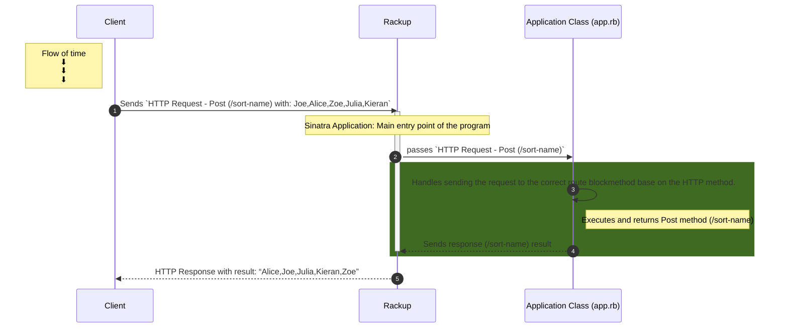

<!-- 
This diagram shows how different parts of a computer program work together.
It shows the steps that happen when someone uses the program. 
In the specific case it is showing how a web application handles a request from a user. 

It starts with a request being made to the program (by someone visiting a website), 
then it goes to the main entry point of the program called "rackup", then it gets passed on to the "Application class" which is responsible for figuring out where to send the request. 

After that, it goes to the "route block" which carries out the specific tasks needed to complete the request and sends a response back to the user.

-->