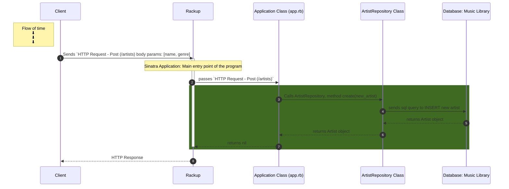

```mermaid
sequenceDiagram
    participant C as Client
    participant RU as Rackup
    participant AC as Application Class (app.rb)
    participant AR as ArtistRepository Class
    participant D as Database: Music Library


    Note left of C: Flow of time <br />⬇ <br /> ⬇ <br /> ⬇ 
    autonumber
    C->>RU: Sends `HTTP Request - Post (/artists) body params: [name, genre]
   
    activate RU
    Note over RU: Sinatra Application: Main entry point of the program
    
    RU->>AC: passes `HTTP Request - Post (/artists)`
    rect rgb(62, 107, 33)
    AC->>AR: Calls ArtistRepository, method create(new_artist)
    AR->>D: sends sql query to INSERT new artist
    D-->>AR: returns Artist object
    AR-->>AC: returns Artist object
    AC-->>RU: returns nil
    deactivate RU
    end
    RU-->>C: HTTP Response  
    
```
