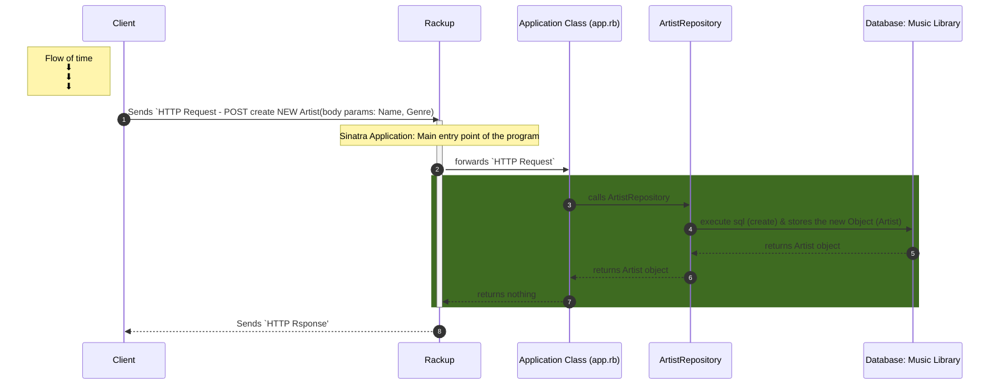

```mermaid
sequenceDiagram
    participant C as Client
    participant RU as Rackup
    participant AC as Application Class (app.rb)
    participant AR as ArtistRepository
    participant D as Database: Music Library


    Note left of C: Flow of time <br />⬇ <br /> ⬇ <br /> ⬇ 
    autonumber
    C->>RU: Sends `HTTP Request - POST create NEW Artist(body params: Name, Genre) 
    activate RU
    Note over RU: Sinatra Application: Main entry point of the program
    
    RU->>AC: forwards `HTTP Request`
    rect rgb(62, 107, 33)
    AC->>AR: calls ArtistRepository#create(new_artist)
    AR->>D: execute sql (create) & stores the new Object (Artist)
    D-->>AR: returns Artist object
    AR-->>AC: returns Artist object
    AC-->>RU: returns nothing
    end
    deactivate RU
    RU-->>C: Sends `HTTP Rsponse'
    
```